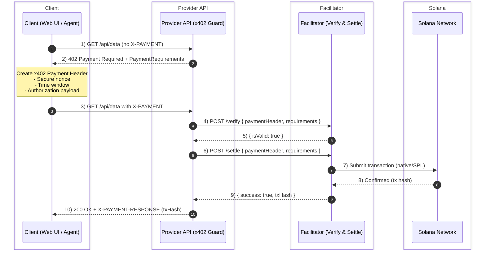
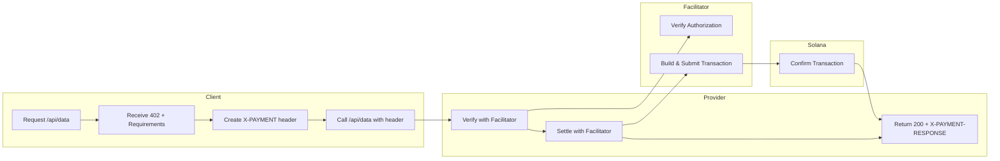

# 🚀 MicroAPI Hub


<div align="center">

**Complete x402 (Solana) payment protocol implementation for API monetization**

[](LICENSE)
[](https://www.typescriptlang.org/)
[](https://solana.com/)
[](https://nextjs.org/)
[](https://nodejs.org/)

**Built for the Solana X402 Hackathon** 🏆

[Features](#-features) • [Architecture](#️-architecture) • [Quick Start](#-quick-start) • [Documentation](#-documentation) • [Contributing](#-contributing)

</div>

---

## 📋 Table of Contents

- [Overview](#-overview)
- [Features](#-features)
- [Tech Stack](#-tech-stack)
- [Architecture](#️-architecture)
- [Quick Start](#-quick-start)
- [Services](#-services)
- [Documentation](#-documentation)
- [Development](#-development)
- [Hackathon Submission](#-hackathon-submission)
- [Contributing](#-contributing)
- [License](#-license)

---

## 🎯 Overview

**MicroAPI Hub** is a complete end-to-end implementation of the [x402 payment protocol](https://github.com/coinbase/x402) for Solana, enabling API providers to monetize their endpoints with blockchain payments. This project demonstrates how to build a production-ready payment system that integrates seamlessly with Solana's blockchain.

### What is x402?

x402 is an open payment standard that enables clients to pay for external resources (APIs, content, data) using blockchain payments. It follows HTTP status code 402 (Payment Required) semantics and provides a standardized way to implement pay-per-use APIs with on-chain settlement and verifiable receipts.

### Key Highlights

- ✅ **Full Protocol Compliance**: Complete x402 specification implementation
- ✅ **Solana Integration**: Native SOL and SPL token support
- ✅ **Production-Ready**: Error handling, validation, logging, testing
- ✅ **Developer-Friendly**: Comprehensive docs, code examples, easy integration
- ✅ **On-Chain Registry**: Decentralized API discovery
- ✅ **Multi-Language Support**: TypeScript, Python, Go examples

---

## ✨ Features

### 🔐 Payment Processing
- **Payment Verification**: Cryptographically secure signature verification
- **On-Chain Settlement**: Automatic blockchain transaction processing
- **Multi-Token Support**: Native SOL and SPL tokens (USDC, etc.)
- **Nonce Replay Protection**: Prevents double-spending attacks
- **Time Window Validation**: Ensures payment freshness

### 🌐 Web Interface
- **Wallet Integration**: Connect with Phantom, Solflare, and other Solana wallets
- **Payment Modal**: User-friendly payment flow with real-time status
- **Transaction History**: View and verify all payment receipts
- **Resource Discovery**: Browse available paid APIs
- **Receipt Viewer**: Verify transactions on Solscan

### 🔧 Developer Tools
- **RESTful API**: Standard HTTP endpoints
- **Discovery Endpoint**: `.well-known/x402` protocol compliance
- **Code Examples**: TypeScript, Python, Go implementations
- **Comprehensive Docs**: API reference, developer guide, tutorials
- **E2E Testing**: Complete test suite

### 📊 On-Chain Registry
- **Decentralized Discovery**: Query APIs from Solana blockchain
- **Provider Registration**: Register your API on-chain
- **Category Organization**: Organize APIs by type
- **Active/Inactive Management**: Control API availability

---

## 🛠️ Tech Stack

### Backend
-  **Node.js 18+** - Runtime environment
-  **TypeScript 5.6** - Type-safe development
-  **Express.js** - Web framework
-  **Zod** - Schema validation

### Blockchain
-  **Solana** - Blockchain platform
-  **Anchor Framework** - Solana program framework
-  **@solana/web3.js** - Solana JavaScript SDK
-  **@solana/spl-token** - Token operations

### Frontend
-  **Next.js 14** - React framework
-  **React 18** - UI library
-  **Tailwind CSS** - Styling
-  **@solana/wallet-adapter** - Wallet integration

### Infrastructure
-  **Docker** - Containerization
-  **Redis** - Caching & storage (optional)
-  **Vitest** - Testing framework

### Tools & Libraries
-  **Pino** - Logging
-  **date-fns** - Date utilities
-  **react-hot-toast** - Notifications

---

## 🏗️ Architecture

### System Architecture Diagram


### UML Sequence Diagram (Swimlanes)

The following Mermaid diagram shows the end-to-end x402 payment flow across swimlanes for Client, Provider, Facilitator, and Solana:



Alternatively, here is a swimlane-style activity view using Mermaid flowchart subgraphs (lanes):



### Payment Flow Sequence

```
┌─────────┐         ┌──────────┐         ┌─────────────┐         ┌──────────┐
│ Client  │         │ Provider │         │ Facilitator │         │ Solana   │
└────┬────┘         └────┬─────┘         └──────┬──────┘         └────┬─────┘
     │                   │                      │                     │
     │ 1. GET /api/data  │                      │                     │
     ├──────────────────►│                      │                     │
     │                   │                      │                     │
     │ 2. 402 Payment    │                      │                     │
     │    Required       │                      │                     │
     │    + Requirements │                      │                     │
     │◄──────────────────┤                      │                     │
     │                   │                      │                     │
     │ 3. Create Payment │                      │                     │
     │    Authorization  │                      │                     │
     │    (with nonce)   │                      │                     │
     │                   │                      │                     │
     │ 4. POST /api/data │                      │                     │
     │    + X-PAYMENT    │                      │                     │
     │    header         │                      │                     │
     ├──────────────────►│                      │                     │
     │                   │                      │                     │
     │                   │ 5. POST /verify      │                     │
     │                   ├──────────────────────►│                    │
     │                   │                       │                    │
     │                   │ 6. Verify Response   │                     │
     │                   │    {isValid: true}   │                     │
     │                   │◄──────────────────────┤                    │
     │                   │                       │                    │
     │                   │ 7. POST /settle     │                      │
     │                   ├──────────────────────►│                    │
     │                   │                       │                    │
     │                   │                       │ 8. Create Transaction│
     │                   │                       ├─────────────────────►│
     │                   │                       │                      │
     │                   │                       │ 9. Transaction Hash  │
     │                   │                       │◄─────────────────────┤
     │                   │                       │                      │
     │                   │ 10. Settlement Resp  │                       │
     │                   │     {success: true,   │                      │
     │                   │      txHash: "..."}   │                      │
     │                   │◄──────────────────────┤                      │
     │                   │                       │                      │
     │ 11. 200 OK        │                       │                      │
     │     + X-PAYMENT-  │                       │                      │
     │     RESPONSE      │                       │                      │
     │◄──────────────────┤                       │                      │
     │                   │                       │                      │
```

### Component Interaction

```
┌─────────────────────────────────────────────────────────────┐
│                     Web UI (Next.js)                        │
├─────────────────────────────────────────────────────────────┤
│                                                             │
│  ┌──────────────┐  ┌──────────────┐  ┌──────────────┐       │
│  │   Wallet     │  │   Payment    │  │  Resource    │       │
│  │   Provider   │  │   Modal      │  │   Card       │       │
│  │              │  │              │  │              │       │
│  │  • Connect   │  │  • Show     │  │  • Display    │       │
│  │  • Sign      │  │    Amount    │  │    Info      │       │
│  │  • State     │  │  • Execute   │  │  • Trigger   │       │
│  └──────────────┘  └──────────────┘  └──────────────┘       │
│                                                             │
└─────────────────────────────────────────────────────────────┘
                            │
                            │ HTTP
                            ▼
┌─────────────────────────────────────────────────────────────┐
│                  Provider API Service                       │
├─────────────────────────────────────────────────────────────┤
│                                                             │
│  ┌────────────────────────────────────────────────────┐     │
│  │              x402 Guard Middleware                 │     │
│  │                                                    │     │
│  │  1. Check X-PAYMENT header                         │     │
│  │  2. If missing → Return 402                        │     │
│  │  3. If present → Verify with Facilitator           │     │
│  │  4. If valid → Settle with Facilitator             │     │
│  │  5. If settled → Allow request to proceed          │     │
│  └────────────────────────────────────────────────────┘     │
│                            │                                │
│                            │ POST /verify, /settle          │
│                            ▼                                │
└─────────────────────────────────────────────────────────────┘
                            │
                            │
                            ▼
┌─────────────────────────────────────────────────────────────┐
│                  Facilitator Service                        │
├─────────────────────────────────────────────────────────────┤
│                                                             │
│  ┌────────────────────────────────────────────────────┐     │
│  │              Verification Engine                   │     │
│  │                                                    │     │
│  │  • Parse payment header                            │     │
│  │  • Validate signature                              │     │
│  │  • Check nonce (replay protection)                 │     │
│  │  • Validate time window                            │     │
│  │  • Verify amount & recipient                       │     │
│  └────────────────────────────────────────────────────┘     │
│                            │                                │
│  ┌────────────────────────────────────────────────────┐     │
│  │              Settlement Engine                     │     │
│  │                                                    │     │
│  │  • Create Solana transaction                       │     │
│  │  • Sign with fee payer                             │     │
│  │  • Submit to blockchain                            │     │
│  │  • Wait for confirmation                           │     │
│  │  • Return transaction hash                         │     │
│  └────────────────────────────────────────────────────┘     │
│                            │                                │
│                            │ RPC                            │
│                            ▼                                │
└─────────────────────────────────────────────────────────────┘
                            │
                            │
                            ▼
                    ┌──────────────┐
                    │   Solana     │
                    │  Blockchain  │
                    └──────────────┘
```

---

## 🚀 Quick Start

### Prerequisites

-  Node.js 18+ and npm/pnpm
-  Solana CLI (optional, for contract deployment)
-  Docker (optional, for containerized deployment)

### Installation

```bash
# Clone the repository
git clone https://github.com/yourusername/microapi-hub.git
cd microapi-hub

# Install dependencies
npm install --workspaces
```

### Start Services

#### 1. Facilitator Service

```bash
cd services/facilitator

# Create .env file
cat > .env << EOF
PORT=8787
NETWORK=devnet
RPC_URL=https://api.devnet.solana.com
FEE_PAYER_SECRET=  # Optional: base58-encoded keypair
SETTLEMENT_MODE=native
DEMO_MODE=true
EOF

# Start facilitator
npm run dev
```

#### 2. Provider API

```bash
cd services/provider-api

# Create .env file
cat > .env << EOF
PORT=8080
PAY_TO_PUBKEY=YOUR_SOLANA_PUBKEY
USDC_MINT=EPjFWdd5AufqSSqeM2qN1xzybapC8G4wEGGkZwyTDt1v
FACILITATOR_URL=http://localhost:8787
EOF

# Start provider API
npm run dev
```

#### 3. Web UI

```bash
cd clients/web

# Create .env.local file
cat > .env.local << EOF
NEXT_PUBLIC_PROVIDER_DISCOVERY_URL=http://localhost:8080/.well-known/x402
EOF

# Start web UI
npm run dev
```

### Access Application

- 🌐 **Web UI**: http://localhost:3000
- 🔌 **Provider API**: http://localhost:8080
- ⚙️ **Facilitator**: http://localhost:8787

---

## 🔧 Services

### Facilitator Service

Payment verification and on-chain settlement service.

**Endpoints:**
- `POST /verify` - Verify payment authorization
- `POST /settle` - Settle payment on-chain
- `GET /health` - Health check
- `GET /supported` - Supported payment schemes

**Key Features:**
- ✅ Signature verification
- ✅ Nonce replay protection
- ✅ Time window validation
- ✅ Native SOL and SPL token settlement
- ✅ Auto-funding on devnet
- ✅ Redis/file-based storage

### Provider API

API server with x402 payment protection.

**Endpoints:**
- `GET /api/data` - Protected endpoint (example)
- `GET /.well-known/x402` - Discovery endpoint
- `GET /health` - Health check

**Key Features:**
- ✅ 402 Payment Required responses
- ✅ Payment verification integration
- ✅ Automatic settlement
- ✅ Discovery endpoint
- ✅ Resource protection middleware

### Web UI

Next.js application with wallet integration.

**Features:**
- ✅ Wallet connection (Phantom, Solflare)
- ✅ Payment modal with real-time status
- ✅ Resource discovery
- ✅ Transaction history
- ✅ Receipt viewer
- ✅ Code examples
- ✅ Comprehensive documentation

---

## 📚 Documentation

### Core Documentation

- 📖 **[API Documentation](docs/API.md)** - Complete API reference with examples
- 👨‍💻 **[Developer Guide](docs/DEVELOPER.md)** - Integration guide and best practices
- 🏆 **[Hackathon Submission](HACKATHON.md)** - Submission details and demo script

### In-App Documentation

- 📝 **Examples**: http://localhost:3000/examples - Code samples in multiple languages
- ❓ **FAQ**: http://localhost:3000/faq - Frequently asked questions
- 📄 **API Docs**: http://localhost:3000/api - Interactive API documentation

---

## 💻 Development

### Project Structure

```
microapi-hub/
├── services/
│   ├── facilitator/          # Payment verification & settlement
│   │   ├── src/
│   │   │   ├── index.ts      # Main facilitator service
│   │   │   ├── config.ts     # Configuration management
│   │   │   ├── errors.ts     # Error handling
│   │   │   └── registry.ts   # Registry client
│   │   └── package.json
│   └── provider-api/         # Protected API server
│       ├── src/
│       │   ├── index.ts      # Main provider service
│       │   └── config.ts     # Configuration
│       └── package.json
├── clients/
│   ├── web/                  # Next.js web UI
│   │   ├── app/              # Next.js app router
│   │   ├── components/        # React components
│   │   ├── lib/               # Utilities
│   │   └── package.json
│   └── agent-demo/            # Example client
├── contracts/
│   └── registry/             # Solana Anchor program
│       └── programs/
│           └── registry/
│               └── src/
│                   └── lib.rs # Registry contract
├── shared/
│   └── types/                 # Shared TypeScript types
│       ├── x402.ts           # x402 protocol types
│       ├── errors.ts         # Error types
│       └── registry.ts      # Registry types
├── docs/                      # Documentation
│   ├── API.md
│   └── DEVELOPER.md
├── infra/                      # Infrastructure
│   └── docker-compose.yml
└── x402/                       # x402 protocol library
```

### Running Tests

```bash
# Run all tests
npm test

# Run E2E tests
npm run e2e
```

### Building

```bash
# Build all services
npm run build
```

### Docker

```bash
# Start all services with Docker Compose
cd infra
docker-compose up
```

---

## 🏆 Hackathon Submission

### Requirements Met

✅ **x402 Protocol Integration**: Full specification implementation  
✅ **Solana Integration**: Deployed to devnet, mainnet-ready  
✅ **Open Source**: All code on GitHub  
✅ **Demo Video**: 3-minute demonstration  
✅ **Documentation**: Comprehensive setup and usage guides  

### Demo Video

See [HACKATHON.md](HACKATHON.md) for demo video script and submission details.

### What Makes This Special

1. **Complete Stack**: End-to-end implementation from facilitator to UI
2. **Production-Ready**: Error handling, validation, logging, testing
3. **Developer-Friendly**: Comprehensive docs, code examples, easy integration
4. **On-Chain Registry**: Decentralized API discovery
5. **Multi-Language**: Support for TypeScript, Python, Go
6. **Wallet Integration**: Seamless payment UX with wallet adapters

---

## 🤝 Contributing

Contributions are welcome! Please feel free to submit a Pull Request.

1. Fork the repository
2. Create your feature branch (`git checkout -b feature/AmazingFeature`)
3. Commit your changes (`git commit -m 'Add some AmazingFeature'`)
4. Push to the branch (`git push origin feature/AmazingFeature`)
5. Open a Pull Request

### Development Guidelines

- Follow TypeScript best practices
- Write tests for new features
- Update documentation
- Follow the existing code style
- Ensure all tests pass

---

## 📝 License

This project is open source. See [LICENSE](LICENSE) file for details.

---

## 🙏 Acknowledgments

- [Coinbase](https://github.com/coinbase/x402) for the x402 protocol specification
- Solana Foundation for the hackathon
- All open-source contributors

---

## 📞 Support

- 📖 **Documentation**: See `/docs` directory
- 💻 **Examples**: http://localhost:3000/examples
- ❓ **FAQ**: http://localhost:3000/faq
- 🐛 **GitHub Issues**: [Repository URL]/issues

---

## 🚧 Roadmap

- [ ] Mainnet deployment
- [ ] Multi-chain support (EVM)
- [ ] Advanced payment schemes
- [ ] Analytics dashboard
- [ ] Webhook notifications
- [ ] Client SDK package
- [ ] Rate limiting per client
- [ ] Usage analytics

---

<div align="center">

**Built with ❤️ for the Solana X402 Hackathon**

[⬆ Back to Top](#-microapi-hub)

</div>
